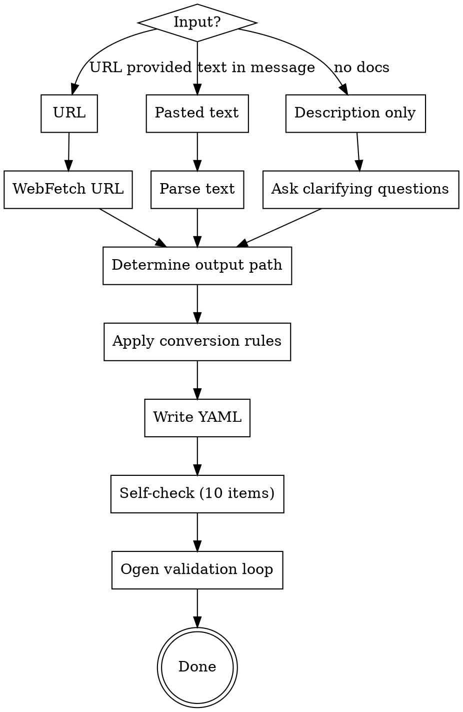
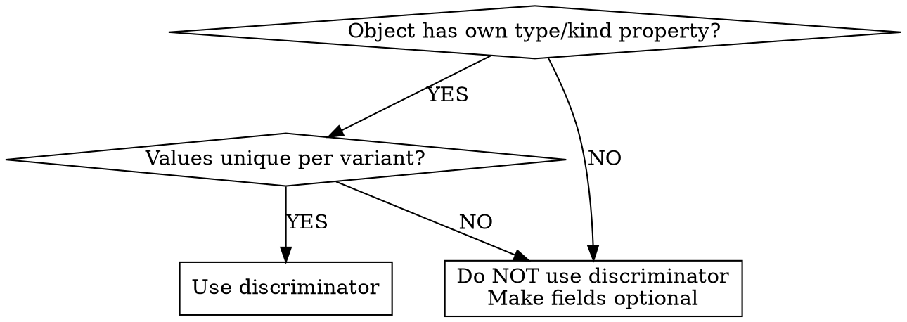

# Text to OpenAPI

Convert web/text API documentation into OpenAPI YAML specs matching the style of existing specs in this repository.

## Command Workflow



1. **Determine input**: URL -> `WebFetch` | pasted text -> parse | description only -> ask questions
2. **Determine output path**: user specifies or ask
3. **Execute conversion** using rules below
4. **Write YAML file**
5. **Run self-check checklist**
6. **MANDATORY: ogen validation cycle** (spec is NOT done until ogen passes)

## Rule 1: Structure & Metadata

```yaml
openapi: 3.0.3        # NOT 3.1.0 — repo uses 3.0.3
info:
  title: <from docs>
  version: "1.0.0"    # or version from docs, quoted if not semver
  description: <Russian or English from docs>
servers:               # if public service: 3 servers; if third-party: only their URL
  - url: https://...
    description: Production
  - url: https://...
    description: Staging
  - url: http://localhost:{port}/
    description: Local development
    variables:
      port:
        default: "<port>"
```

**CRITICAL**: version is `3.0.3`, NOT `3.1.0`. All repo specs use 3.0.x.

## Rule 2: Paths & Operations

- `summary:` — ALWAYS present, ALWAYS in English (short phrase)
- `description:` — optional, Russian or English
- `operationId:` — camelCase verb+Noun pattern (`createPayment`, `getTransaction`). Include on all operations.
- `tags:` — PascalCase or Title Case, flow syntax `tags: [TagName]`
- Security per-operation (not global): `security: - AuthHeader: []`
- `requestBody: required: true` always set on POST/PUT/PATCH
- Content type always `application/json` (no other types exist in repo)

## Rule 3: Parameters

- Header params -> `in: header` (e.g., auth keys, app platform/version)
- Query params -> `in: query`, `required: true/false` per docs
- Path params -> `in: path`, ALWAYS `required: true`
- Reusable params defined in `components/parameters` and referenced via `$ref`

## Rule 4: Response Codes

```yaml
responses:
  200:
    description: <Russian>
    content:
      application/json:
        schema:
          $ref: "#/components/schemas/ResponseSchema"
  401:
    description: Не авторизован   # body-less, NO content block
  403:
    description: Сессия истекла   # body-less
  default:
    description: Unexpected error
    content:
      application/json:
        schema:
          $ref: "#/components/schemas/ErrorDefault"
```

**Key patterns:**
- 4xx responses (401, 403, 404) are body-less — just `description:`, NO `content:`
- `default:` response ALWAYS present, points to `ErrorDefault`
- Success responses (200, 204) have content with schema ref

## Rule 5: Error Schema

Standard `ErrorDefault` used across the repo:

```yaml
ErrorDefault:
  type: object
  required:
    - code
    - error
  properties:
    code:
      type: integer
      format: int32
    error:
      type: string
```

If the third-party API has a different error structure (like bank131's nested `Error`), model it as a separate schema matching their actual structure. Do NOT force `ErrorDefault` on third-party APIs.

## Rule 6: Schema Rules

- **PascalCase** for all schema names: `PaymentDetails`, `AmountDetails`, `TransactionInfo`
- **Property names**: match the source API (snake_case for backend/third-party, camelCase for client-facing)
- `required:` array — block or flow style, placed on `type: object` schemas
- **Zero Duplication**: every repeated object defined ONCE in `components/schemas`, all usages via `$ref: "#/components/schemas/Name"`
- `example:` on individual properties where values are known (not at media-type level)

## Rule 7: Shared Object Optionality

When an object is used across multiple parent contexts and which fields are populated depends on the parent context (not the object itself):
- ALL context-dependent fields must be **optional** (no `required` array for them)
- Document which fields apply to which context in the `description:`
- Do NOT use discriminator — the discrimination context is in the parent, not the object

## Rule 8: Discriminator Usage



Only use `discriminator` when:
- The object ITSELF contains a property that distinguishes variants
- That property is in `required`
- Each value maps to a distinct schema

Pattern:
```yaml
PaymentDetails:
  type: object
  required: [type]
  discriminator:
    propertyName: type
    mapping:
      card: '#/components/schemas/CardPayment'
      fps: '#/components/schemas/FPSPayment'
  properties:
    type:
      type: string
      enum: [card, fps]
```

## Rule 9: Type Mapping & Formats

| Source text | OpenAPI |
|------------|---------|
| UUID | `type: string, format: uuid` |
| String | `type: string` |
| Integer | `type: integer, format: int32` (or `int64` for large IDs) |
| Number | `type: number` |
| Date/DateTime | `type: string, format: date-time` |
| Boolean | `type: boolean` |
| IP address | `type: string, format: ipv4` |
| URL | `type: string, format: uri` |
| Email | `type: string, format: email` |

## Rule 10: What NOT to Use

These patterns do NOT exist in the repo and must NOT be generated:

- ~~`nullable: true`~~ — NEVER used. Not a single occurrence.
- ~~`type: [string, null]`~~ — 3.1 syntax, not used (repo is 3.0.x)
- ~~`anyOf`~~ — not used in active code (only in comments)
- ~~`contact:` in info~~ — never used
- ~~`license:` in info~~ — never used
- ~~`examples:` at media-type level~~ — avoid

## Rule 11: Features to USE When Applicable

- `allOf` — for extending base schemas with additional properties
- `oneOf` — for polymorphic types (with or without discriminator)
- `additionalProperties: true` — for loosely-typed objects
- `additionalProperties: { type: string }` — for string-valued maps
- `example:` on individual properties
- `default:` on properties when source specifies defaults
- `maximum:`, `minimum:`, `maxLength:`, `minItems:`, `maxItems:` — when source specifies constraints
- `pattern:` — when source specifies format patterns
- `enum:` — for all known fixed value sets, values in lowercase_snake_case

## Rule 12: Cross-file References

When schemas are shared across multiple spec files:
```yaml
$ref: "./shared-file.swagger.yaml#/components/schemas/SchemaName"
```
Always use `./` prefix for relative paths.

## Rule 13: Security Schemes

All auth is `type: apiKey`:
```yaml
securitySchemes:
  AuthHeader:
    type: apiKey
    in: header
    name: X-Auth        # or X-Api-Key, Authorization, etc.
```
Applied per-operation, not globally (unless the API genuinely requires it on every endpoint).

## Self-Check Before Ogen

Run through ALL items before validation:

1. Every endpoint from source documentation exists in `paths`
2. All required parameters have `required: true`
3. Every path has a `default` error response
4. 4xx responses are body-less (just `description:`)
5. All reused objects defined once in `components/schemas`, referenced via `$ref`
6. No `nullable: true` anywhere
7. `openapi: 3.0.3` (not 3.1.0)
8. `example:` values on properties where known
9. Schema names are PascalCase
10. Shared objects with context-dependent fields have all such fields optional

## Ogen Validation Cycle (MANDATORY)

**Pre-requisite — ensure ogen is installed:**

1. Check: `which ogen`
2. If NOT found -> ask user permission to install
3. If approved -> run: `go install -v github.com/ogen-go/ogen/cmd/ogen@latest`
4. Verify: `ogen --version`

**Validation loop:**

1. Run: `ogen --target /tmp/ogen-validate --clean <spec-file.yaml>`
2. SUCCESS -> semantic review (step 3). FAILURE -> read error, fix spec, re-run (loop)
3. Re-read source docs, verify spec matches (endpoints, fields, types, required/optional)
4. Re-run ogen after semantic fixes

**Constraints:** fixes must not violate skill rules, must not diverge from source docs. If ogen requires a structure conflicting with source, document deviation in YAML comment.

**Spec is NOT done until ogen passes.**

## Comprehensive Example

```yaml
openapi: 3.0.3
info:
  title: Example Payment API
  version: "1.0.0"
  description: API для обработки платежей

servers:
  - url: https://api.example.com

paths:
  /payment/create:
    post:
      summary: Create payment
      operationId: createPayment
      tags: [Payment]
      security:
        - AuthHeader: []
      requestBody:
        required: true
        content:
          application/json:
            schema:
              $ref: "#/components/schemas/CreatePaymentRequest"
      responses:
        200:
          description: Платёж успешно создан
          content:
            application/json:
              schema:
                $ref: "#/components/schemas/PaymentResponse"
        401:
          description: Не авторизован
        403:
          description: Сессия истекла
        default:
          description: Unexpected error
          content:
            application/json:
              schema:
                $ref: "#/components/schemas/ErrorDefault"

components:
  securitySchemes:
    AuthHeader:
      type: apiKey
      in: header
      name: X-Auth

  schemas:
    ErrorDefault:
      type: object
      required:
        - code
        - error
      properties:
        code:
          type: integer
          format: int32
        error:
          type: string

    CreatePaymentRequest:
      type: object
      required:
        - amount
        - currency
        - payment_type
      properties:
        amount:
          type: integer
          format: int32
          example: 19900
          description: Сумма в минорных единицах
        currency:
          type: string
          example: "rub"
          enum: [rub, usd]
        payment_type:
          type: string
          enum: [card, fps]

    # Discriminator: object has own type property with unique values
    PaymentResponse:
      type: object
      required:
        - id
        - status
        - details
      properties:
        id:
          type: string
          format: uuid
          example: "550e8400-e29b-41d4-a716-446655440000"
        status:
          type: string
          enum: [pending, success, failure]
          example: "pending"
        details:
          $ref: "#/components/schemas/PaymentDetails"

    PaymentDetails:
      type: object
      required: [type]
      discriminator:
        propertyName: type
        mapping:
          card: "#/components/schemas/CardPayment"
          fps: "#/components/schemas/FPSPayment"
      properties:
        type:
          type: string
          enum: [card, fps]

    CardPayment:
      allOf:
        - $ref: "#/components/schemas/PaymentDetails"
        - type: object
          required:
            - masked_pan
          properties:
            masked_pan:
              type: string
              example: "4111****1111"

    FPSPayment:
      allOf:
        - $ref: "#/components/schemas/PaymentDetails"
        - type: object
          properties:
            qr_url:
              type: string
              format: uri
              example: "https://qr.nspk.ru/xxx"
            bank_id:
              type: string
              example: "sber"

    # Shared object: context-dependent fields are optional
    TransactionInfo:
      type: object
      description: >
        Shared across payment and refund contexts.
        amount_refunded populated only in refund context.
        original_payment_id populated only in refund context.
      required:
        - id
        - created_at
      properties:
        id:
          type: string
          format: uuid
        created_at:
          type: string
          format: date-time
          example: "2025-06-11T12:34:56+0400"
        amount_refunded:
          type: integer
          format: int32
        original_payment_id:
          type: string
          format: uuid
```

## Common Mistakes

| Mistake | Fix |
|---------|-----|
| Using `openapi: 3.1.0` | Always `3.0.3` |
| Adding `nullable: true` | Remove it — never used in repo |
| 401/403 with `content:` block | Remove content — 4xx are body-less |
| Missing `default:` response | Add with `ErrorDefault` ref |
| Duplicated inline schemas | Extract to `components/schemas`, use `$ref` |
| Discriminator on parent-context object | Make fields optional instead |
| `anyOf` usage | Use `oneOf` or optional fields |
| camelCase schema names | PascalCase always |
| Missing `required: true` on requestBody | Always set for POST/PUT/PATCH |
